# DDD Tutorial - Building a Personal Finance Management Application #

### Index ###

* Introduction
* OOP (Object Oriented Programming)
* Overview - Project Structure
* Software Development Process (SDP)
    * (1) Requirements
    * (2) Analysis
    * (3) Design
    * (4) Implementation
* Final considerations
* Bibliography

Topics covered: domain driven design (ddd), software engineering, web development, 
software development process (sdp), design patterns, design principles, responsibility driven design (rdd),
software architecture, architectural design, unified modeling language (uml), web application

***


### Introduction ###

This repository aims to be a hands-on tutorial on the **software development process** by building a Web 
Application ("Personal Finance Management"), with a strong focus on the implementation of a 
**Domain-Driven Design** (DDD) architecture.

To understand the adoption of a DDD architecture, it's important to be familiar with **core concepts**, such
as design patterns and principles (GRASP, SOLID), architectural requirements and Object-Oriented design.

The main reason why I'm doing this tutorial is because, in my opinion, there's not many
*educational* tutorials about DDD, and I hope I can share (to other students or engineers) a little bit 
of my knowledge as I believe **modularity** is one of the most important characteristics in Software Development.

Modularity is the property of a system to be decomposed in a set of **cohesive modules with low coupling**.
Low modularity is a sign of bad software design, as it will provoke a rigid / non flexible code. 

I will introduce these concepts in the context of the **Software Development Process (SDP)**,
which consists in four stages:

* (i) Requirements
* (ii) Analysis of requirements
* (iii) Design
* (iv) Code Implementation (and testing)

As the foundation for this tutorial, we will be implementing a **Web application** whose main goal is to establish a 
platform for **managing personal finances**.

The project was implemented through a DDD architecture (Domain-Driven Design), and 
the technologies (stack) used were:

* Back-end (*backend* folder):
    * Java (with Spring framework);

* Front-end (*src* folder):
    * JavaScript (with React library);

With this current ReadMe file, not only am I attempting to explain the project's functionality,
but I am also attempting to describe the underlying principles behind the adoption of
a DDD architecture, as well as an overview of the entire **(SDP)**.


***

### OOP (Object Oriented Programming) ###

**OOP vs Functional Programming**

**Functional programming** is a method of programming that is focused on using functions to carry out operations. 
On the opposite side, **Object-oriented programming** (“OOP”) is a programming paradigm based on the concept 
of “objects”. An object is essentially a piece of code that lets you create many similar pieces of code without 
actually re-writing the code each time. This is done by first writing a “class”, which is essentially a blueprint 
of the object, and then you can easily create an “instance” of the object, which is basically just one particular 
version of the object, built from the blueprint. 

A **software class** defines the **attributes** (state) and the **behavior** (methods) of an object - it is basically
a blueprint for objects, that describes what the objects will be (what they know and what they do).

In my opinion, OOP is very powerful weapon because it is a way of building software that encapsulates the 
responsibilities of the system in a community of collaborating objects. In OOP, objects are responsible 
for the important work of the system. Throughout this file, it will become evident the many benefits of using an 
Object-oriented language such as Java on a project like this.

OOP is also extremely important as it allow us to manage data in a new way (**customized datatypes**), which is
a step towards **modeling real World entities** (e.g. "Student" class is the new datatype).

There are 4 essential concepts in OOP (also known as the **"pillars of OOP"**):

* (i) **Abstraction** - method declared without implementation (only show essential info to the user). An interface
is a completely abstract class that only contains abstract methods. It can't contain a constructor because
interfaces cannot be instantiated. When you implement an interface, you need to override all of its methods.

* (ii) **Encapsulation** - implementation details not visible to users (use private variables, public getters/setters);

* (iii) **Inheritance** - one class (subclass/child class) acquires properties from another (superclass/parent class). 
A class can inherit from just one superclass, but can implement multiple interfaces.

* (iv) **Polymorphism** - hierarchy of classes through inheritance;

For additional information on OOP and the Unified Modeling Language (UML), please check the file entitled **"UML.md"**
available in the current repository. With real examples, I believe it becomes easier to understand these
four important concepts to OOP.

This project started out as an anemic model. An **anemic model** is a model where the domain objects contain little or 
no business logic. In the next chapters, you'll see the evolution of this project from an anemic model 
until the current structure, with **highly modular** software classes.

If the domain objects contain little or no business logic, that is obviously a bad software practice.
Therefore, [avoiding an anemic model](https://www.infoworld.com/article/2073723/why-getter-and-setter-methods-are-evil.html) is something you should deeply consider.


***


### Overview - Project Structure ###

The picture below illustrates the final software architecture of this current project. 

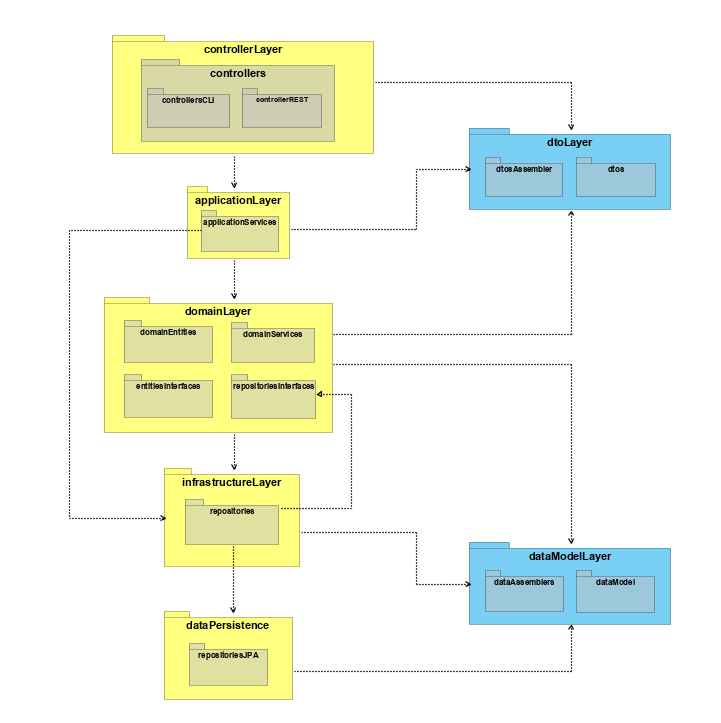

The above diagram corresponds to the Implementation View of the 
[4+1 Architectural View Model](https://en.wikipedia.org/wiki/4%2B1_architectural_view_model) (also known 
as Development View). 

Don't worry if you've never heard of this model or of the [C4 model for visualizing software architecture](https://c4model.com/) - we'll get there
in a second.

If you're new to Software Development or curious to learn more, I will provide - in the next sections -
a step-by-step guide to explain how we got to the current architectural project structure and the entire evolution 
of this project, from an initial [anemic model](https://martinfowler.com/bliki/AnemicDomainModel.html) to a final model 
adopting a DDD architecture with high **modularity**.

Modularity is one of the most important concepts in Software Development and it basically
means to have classes with "high cohesion and low coupling".

A software class with high cohesion and low coupling should, ideally, only be concerned
with one unique function / responsibility. Therefore, a good SDP puts emphasis on
the creation of several classes, with each one only concerned with one function.

One of the **main problems** in Software Engineering is the high costs of Software maintenance.
For companies, it's extremely expensive to continuously hire employees to maintain a *not-so-well conceived*
software component. 

Typically, **bad software** is known as rigid, not flexible and not adaptable. Since we enjoy programming and
creating new things, we might as well do it right and learn the right patterns and *rules*
to avoid creating *poor-quality* software.

Therefore, to achieve high modularity we should really be concerned about attributing *responsibilities*
to classes/objects. **Responsibility-Driven Design** (RDD) is a design technique in object-oriented programming (OOP),
which improves encapsulation by using the client–server model.

RDD is about thinking how to attribute responsibilities to objects. It includes the idea of **collaboration
between objects**.

**Design patterns** are very important in the context of RDD. Patterns are typical solutions to common problems 
in object-oriented design. In the 3rd chapter of this current ReadMe file, you'll find a deeper analysis
on this subject. Some of the most important **design patterns and principles** that help us to achieve a more
flexible code are:

* GRASP;
* SOLID;
* STUPID.

But don't worry about this *right* now! If you read throughout this file, in a couple of minutes I will approach
these design principles in detail. There are many other well discussed patterns.

However, there's always a reason to everything and we shouldn't apply any design pattern carelessly or
without a valid reason. 

To justify the importance (and need) of applying these design patterns, I will illustrate the entire evolution
of this current project, from the initial *anemic* model until the diagram pictured above. This way, it will
become much clearer why we are actually applying these patterns and its advantages for software development.

Oh - I almost forgot about **three of my favorite** design principles:
* DRY (Don't Repeat Yourself) / YAGNI (You Ain't Gonna Need It);
* KISS (Keep It Stupid Simple);
* Tell, Don't Ask.

While the first two principles might be quite obvious, the third one requires a bit more detail. 
**"Tell-Don't-Ask"** is a principle that helps people remember that **object-orientation is about bundling 
data with the functions that operate on that data**. Rather than asking an object for data and acting on 
that data, **we should instead tell an object what to do**.


***

### Software Development Process (SDP) ###

In software engineering, a **software development process** (SDP) is the process of dividing software development 
work into distinct phases to improve design, product management, and project management. It is also 
known as software development life cycle (SDLC), and it is represented in the picture below.                                                                                                 

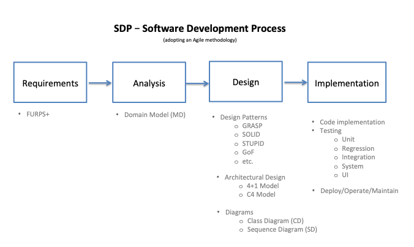

Most modern development processes can be vaguely described as *Agile*. The term was coined in the year 2001 when the 
*Agile Manifesto* was formulated. **Agile  is a software development methodology** that 
uses iterative development as a basis but advocates a lighter and more *people-centric* viewpoint than 
traditional approaches. Agile processes fundamentally incorporate iteration and continuous feedback 
between developers and clients in order to successfully deliver a software system.

From hereafter, I will explain each of the **four stages of the SDP** as pictured above, while establishing 
a parallelism with the adoption of a DDD architecture. Step by step, it will become clear the importance
of **creating several classes highly cohesive** (that is, only concerned with one function).

In the next section I will start out with the exact same way every project should begin: by its requirements.

***


### 1. Requirements ###

The first stage of the SDP is always the **requirements**. Without requirements (from the client, a friend or
someone else) there is not much you can do.

FURPS+ is an acronym representing a model for classifying software quality attributes (functional and 
non-functional requirements). The model, developed at Hewlett-Packard, is now widely used in the software industry.

I've recently found out a [great article](https://www.ibm.com/developerworks/rational/library/4706.html#N100A7) by IBM
entitled "Capturing Architectural Requirements". I thought it was really well written and I will do my best to sum it
up in the following table.


**The non-functional requirements** are the ones that drive architectural decisions. 

Furthermore, the **system's architecture** establishes the context for the design and its implementation.
Take a look at some of the most well-known architectural styles in the following table.


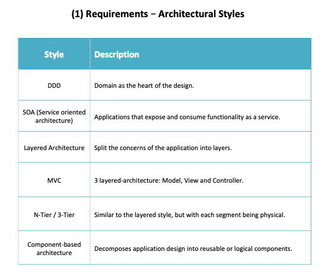

The main goal - regarding the architectural style - is to **create flexible designs** that are maintainable and can cope
with change.

For this particular project - since it is an academic project - we were given the following requirements regarding the
business model:

```
Web App for Personal Finance Management

Person has a name, an address, a birthdate, a birthplace, a mother, a father and siblings.

People can gather in Groups (e.g. families) and each Group has admins, a description, a date of creation and
a Ledger.

It's mandatory to register the financial transactions of each Person or Group in a Ledger.

Each Transaction is ether credit or debit. It must also have a description, a value and a Category (as much as each
Person wants).

At last, there's still the option to schedule transactions, and each Scheduling includes categories,
periodicity, type (credit or debit), value and Accounts (debit or credit). 
```

Additionally, we were asked to implement several functionalities, known as **User Stories (US)**. Some of
the US consist on simple tasks, such as:

* US002.1 – As a user, I want to create a group, becoming a group administrator;
* US005.1 - As a group administrator, I want to create a category and associate it with the group.
* US010 - As a user/group member, I want to obtain the transactions of a certain account in a given period.

The full list of US can be found in the **UserStories.txt** file in this current repository.
Almost every US was implemented throughout the project.


***

### 2. Analysis ###

After receiving the project requirements, the second stage of the SDP is the **analysis of the requirements**.
Based on the story described, we should be able to differentiate between **Conceptual Classes**, **Associations** 
and **Attributes**.

To succeed in the analysis stage, we must be able to know the **business model**, understand it and think about it.

In the following table, we'll analyse how to identify the mentioned concepts:

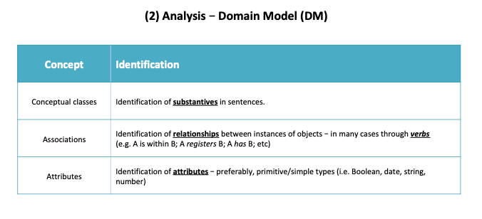

Through this analysis - and considering the Requirements - we are able to define our first **Domain Model (DM)**.

The DM is a visual representation (UML) of the conceptual classes of our business model. It is basically
a tool that helps us to understand better the business and it facilitates the communication between
the Client and the Development team. 


On this DM, we can clearly establish and verify all the conceptual classes, their associations and their
attributes.

Defining the DM is a very important first step in the process of Software Engineering, as it is
the **foundation for the rest of your process**.

***


### 3. Design ###

The third stage of the SDP is the **design** options and patterns.

#### 3.1 Design Patterns ####

Why are so design patterns so important? First of all, **Design patterns** are typical solutions to commonly 
occurring problems in software design.

A pattern is a **high-level description of a solution**. The code of the same pattern applied to two 
different programs may be different.

The most universal and high-level patterns are architectural patterns. Developers can implement these 
patterns in **virtually any language**. Unlike other patterns, they can be used to design the architecture of an 
entire application.

To sum it up, Design patterns are important because they can be used as a **toolkit of tried and 
tested solutions to common problems in software design**.

We will now analyse four important patterns in software engineering:
* GRASP;
* SOLID;
* STUPID;
* Gang of Four (GoF).

##### 3.1.1 GRASP #####

GRASP stands for **General Responsibility Assignment Software Patterns** and it consists of a set of guidelines 
for assigning responsibility to classes and objects in OO design. All these patterns answer some software problems, 
and these problems are common to almost every software development project.

GRASP promotes **modularity, code reuse and maintainability**. The following table explains in detail each
one of the GRASP principles, which are combined between them:


I've **highlighted** the three principles which I consider to be the most important ones.


##### 3.1.2 SOLID #####

**SOLID** is an acronym for the first five object-oriented design (OOD) principles that, when combined together, 
make it easy for a programmer to develop software that is easy to maintain and extend. They also make it easy for developers 
to avoid code smells, **easily refactor code**, and are also a part of the **agile or adaptive software development**.


SOLID seem to be a handful at first, but with continuous usage it becomes a part of you and your code which can easily be 
extended, modified, tested, and refactored without any problems.


##### 3.1.3 STUPID #####

As the acronym indicates, STUPID is a set of **bad practices**, mistakes, and anti-patterns that lead to 
waste of both time and money. Let's analyse these patterns in more detail:


**Singleton** might be a tricky one, as it is used by many intermediate programmers and I believe it can be 
[useful in some cases](https://stackoverflow.com/questions/228164/on-design-patterns-when-should-i-use-the-singleton). 
However, it's still an [anti-pattern](https://www.ict.social/software-design/design-patterns/gof/gof-creational-patterns/singleton-design-pattern)
as they violate the SRP and cause code to be tightly coupled.

We've just learnt the SOLID and STUPID patters, and therefore I think it's a good time for you to read
this article entitled [from STUPID to SOLID code](https://williamdurand.fr/2013/07/30/from-stupid-to-solid-code/).
Even though it's an old article (2013), I still believe it's very important nowadays.

```
As you probably noticed, avoiding tight coupling is the key. It is present in a lot of code, and if you start 
by focusing on fixing this alone, you will immediately start writing better code.
```


##### 3.1.4 Gang of Four (GoF patterns) #####

Ok, so this is the last set of patterns we will approach in this tutorial. 
The [Gang of Four](http://www.blackwasp.co.uk/gofpatterns.aspx) (GoF) are the four authors of the book
"Design Patterns: Elements of Reusable Object-Oriented Software" (1994), in which they present twenty-three 
design patterns. Here's a few of them:


All of these principles (and others) are extremely well summed up in the book **"Dive Into Design Patterns" by
Alexander Shvets**, released in 2018 (which I highly recommend).

If you're curious about learning more **design patterns**, you can find a couple more patterns and principles
[here](https://dzone.com/refcardz/design-patterns?chapter=1), in order to build maintainable and scalable software.


#### 3.2 Architectural Design - adopting DDD ####

For this current project, one of the non-functional requirements was to implement a DDD architecture.

DDD is basically the concept that the structure and language of your code should match the business 
domain. DDD helps to **clarify responsibilities** to a set of classes. DDD is more about 
*strategic design* than tactical patterns.

We've already seen that a DDD style has the **Domain as the heart of the design** (as the name says,
*Domain Driven Design*). The business model is, therefore, at the center of every decision.

The **main concepts** in a DDD architecture are the following:

* Entity - it has **business identity** and state (life cycle);
* Value Object (VO) - immutable and **doesn't have identity** (can be shared amongst entities and aggregates);
* Aggregate - set of entities, value objects and their relations (is named after the **root entity** - there's
only *one entity per aggregate*); 
* Service - designed to satisfy a client's **requirement** (e.g. "create an account" service);
* Repository - repositories are responsible for persistence of data. There should exist **one repository per aggregate**;

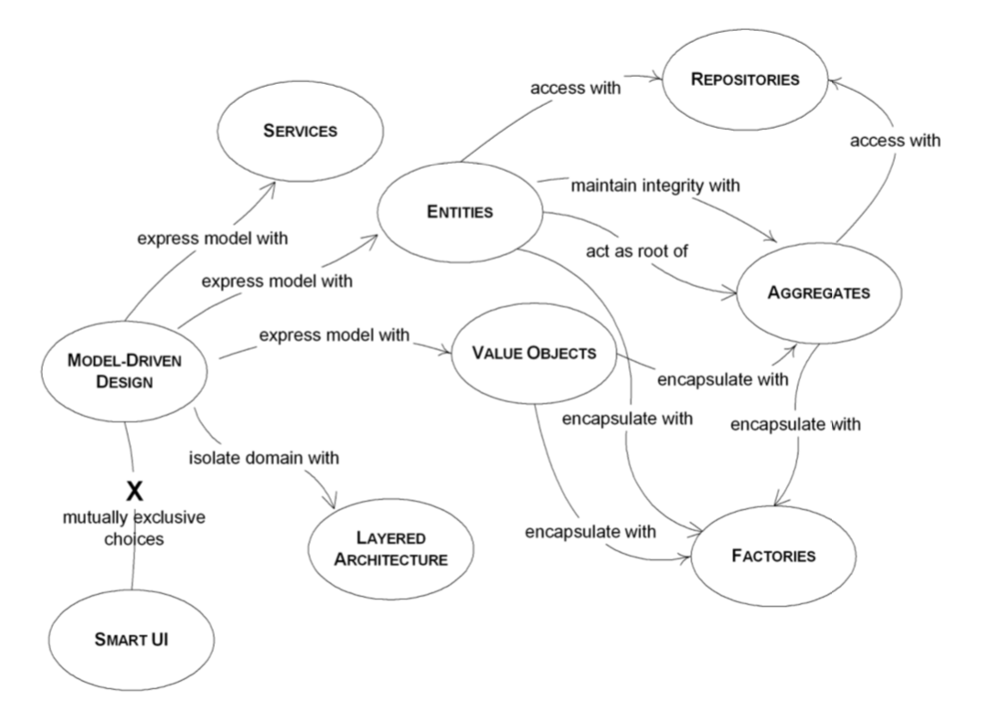

Based on these concepts - **and considering our Domain Model** - we should be able to design our DDD diagram.
In order to do so, we must differentiate between which classes should be promoted to **"Entities"** and which
ones should be considered as **Value Objects**.

Even though this can be a *subjective* process, we were able to design the following DDD model / diagram:


Domain Events and Factories are two additional DDD concepts that are not approached in this tutorial. An
**event** is "something that happens" and it was not a required functionality. A Factory is a set of 
methods for creating domain objects.

However, the concept of **DTOs** (Data Transfer Objects) is essential to communicate between different
layers - for example, we use DTOs in order for our Controller Layer to communicate with our Application
Layer.

A **common architectural solution** for domain-driven designs contain four conceptual layers:

* User Interface (UI) - Responsible for presenting information to the user and interpreting user commands.
* Application Layer - This is a thin layer which coordinates the application activity. It does not contain business logic.
* Domain Layer - 
This layer contains information about the domain. This is the heart of the business software. 
The state of business objects is held here.
* Infrastructure Layer - Persistence of the business objects and possibly their state is delegated to the infrastructure layer.

Therefore, a typical DDD architecture is represented like this:

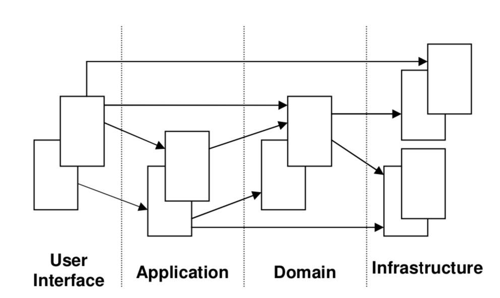

For this tutorial, I've added the Controller Layer with controllers that allow communication between the
User Interface and the Application Layer. Moreover, I've added a Persistence Layer at the bottom with the
persistence repositories.

This quote from Floyd Marinescu (co-founder of InfoQ and author of "DDD Quickly") explains really well 
the importance of the domain:

```
In order to create good software, you have to know what that software is all about. You cannot create a 
banking software system unless you have a good understanding of what banking is all about, one must 
understand the domain of banking.

Is it possible to create complex banking software without good domain knowledge? No way. Never. Who knows banking? 
The software architect? No. He just uses the bank to keep his money safe and available when he needs them. The 
software analyst? Not really. He knows to analyze a given topic, when he is given all the necessary ingredients. 
The developer? Forget it. Who then? The bankers, of course. The banking system is very well understood by the people 
inside, by their specialists. They know all the details, all the catches, all the possible issues, all the rules. 
This is where we should always start: the domain.
```

Considering all this information regarding a DDD model, it is safe to say that adopting this architecture has
the following **advantages**:

* The business and engineering teams **communicate better** because everyone is speaking the same language (something
also known as *ubiquitous language*);

* The software more closely resembles the **business domain**;

* The DDD concept of a *Bounded Context* is the basis for how to sanely **decompose** a 
system/domain into microservices;

* You can develop the software faster after you've made the initial (non-trivial) investment in DDD - and it's 
easier to **adjust** in the future.

Personally, learning DDD changed the way I approach software architecture and programming and it made
clearer the importance of the design principles we've approached (e.g. SRP, high cohesion, low coupling).


##### 3.2.1 Architectural View Model 4+1 #####

The 4+1 Architectural View Model is a model used for "describing the architecture of software-intensive systems, 
based on the use of multiple, concurrent views".

There's not a specific order for the views - they are **complementary between each other**.

The views are used to describe the system from the viewpoint of different stakeholders, such as end-users, 
developers, system engineer, and project managers. 

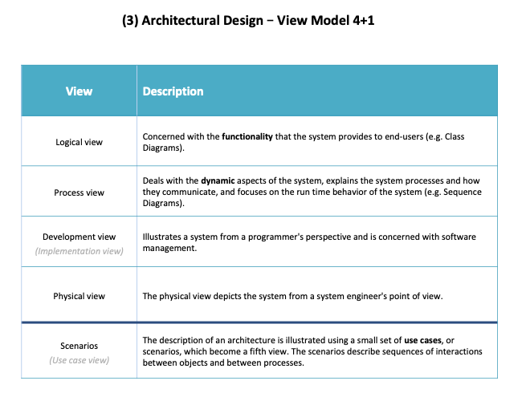

Th advantage of the 4+1 View Model is that it maps stakeholders to the type of information that they need, 
without requiring specific modeling notations to be used. The emphasis is on ensuring that all groups 
have the **information to understand the system** and continue to do their job.

Once you understand what each view is supposed to provide, you can choose what modeling notations to 
use and at **what level of detail** (*granularity*) is required. 


##### 3.2.2 C4 Model #####

The **C4 model** was created as a way to help software development teams describe and communicate software architecture, 
both during up-front design sessions and when documenting an existing codebase. 
It's a way to create maps of your code, at **various levels of detail** (you can zoom in and out of an
area you are interested in - just like Google Maps!).

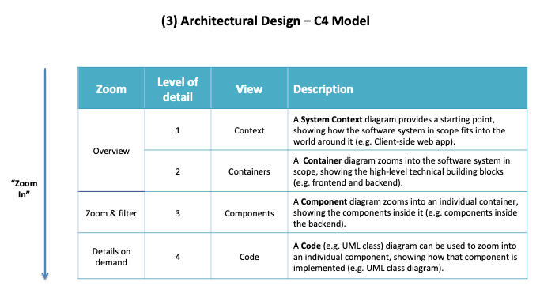

Different levels of zoom (**granularity**) allow you to tell different stories to different audiences.

Software **architecture diagrams** are a fantastic way to **communicate** how you are planning to build a software 
system (up-front design) or how an existing software system works (retrospective documentation, 
knowledge sharing, and learning).

##### 3.2.3 View Model 4+1 & C4 Model (combined) #####

At last, it's worth mentioning that we can combine the Architectural View Model 4+1 with the C4 Model.

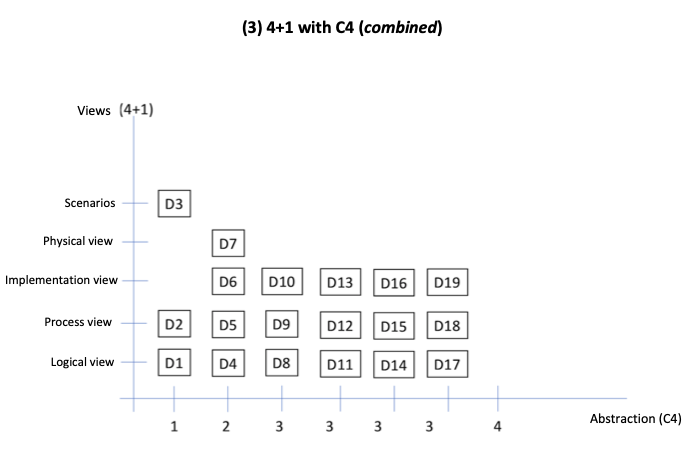

This way, for each level of detail (C4 Model), we have 4+1 different views depending on the agent observing the system 
and we can have up to 19 diagrams (or more). However, we should select the **relevant diagrams** for the project
and the parts interested in viewing them.

Here's an example related to our project:

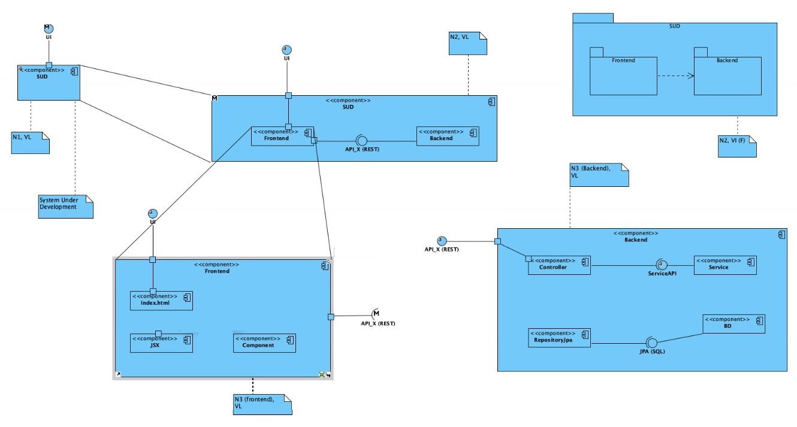

**Legend:**
* SUD - Software Under Development
* VL - Logical View
* VI - Implementation View


#### 3.3 Diagrams (UML) ####

On this stage - considering the appropriate design patterns and principles, as well as the architectural design chosen - 
we **promote the conceptual classes to software classes**. We can create UML diagrams to help us
understand better the solution we want to implement:

* From a static point of view, we have the **Class Diagram** (CD);
* and from a dynamic point of view, we have the **Sequence Diagram** (SD);

Both diagrams should be complementary to each other and elaborated at the same time (check the folder **diagrams** 
in this repository, for an example of a CD and a SD related to a functionality of adding an Account to a Person).

Now let's take a look at a different functionality - check balance from the list of transactions - and its
 **early implementation**:

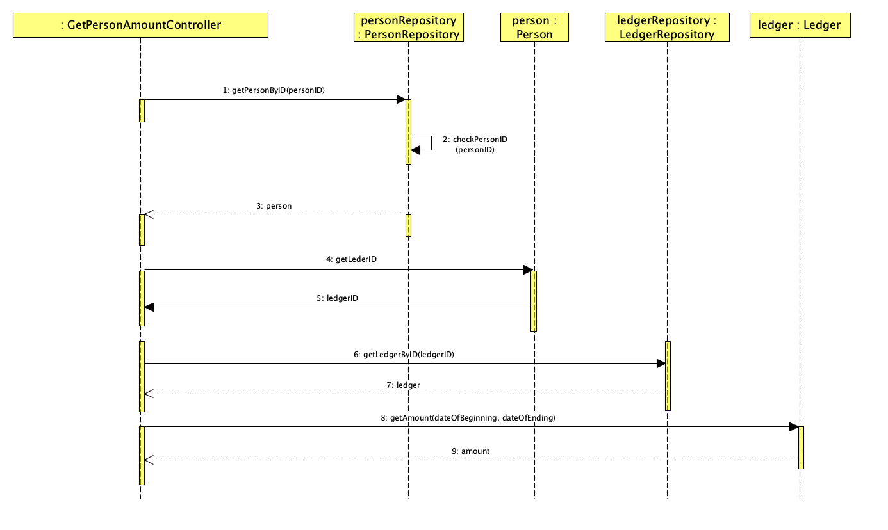

As we can see represented above in the SD, at an initial stage for this project, the controller for this US would 
interact directly to the correspondent repositories in order to find a person and a ledger and execute
the "getPersonAmountBetweenTwoDates" method, which returns a **double** as a result and takes the following
parameters: personID, dateOfBeginning and dateOfEnding.

A couple weeks forward, we've implemented **another simple US** - "as a group administrator, I want to create
a category", as represented below:

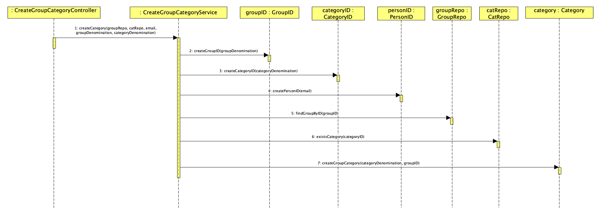

This time around, we've introduced a **service** which interacts with the controller. The service
is the responsible one for interacting with the repositories in order to accomplish the "createCategoryAsPersonInCharge"
method. By adding another layer, we are increasing the cohesion and lowering the coupling between classes.

In these SD's, the domain model is still responsible for persistence functions.
According to the SRP, this should not happen - therefore, we've created an additional layer entitled
"dataModel", which acts as a *copy* of the Domain Model and has the unique function of
persisting data in a JPA Repository.

Furthermore, a "dataAssembler" package was created to make the transformation from the domain model
to the data model.

For a change, let's analyse a CD (static point of view) for another US: "**adding an Account to a
Person**":

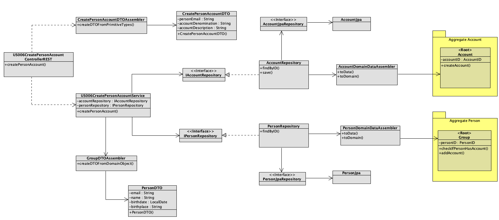

Let's break down this CD into its many stages:
* In the first place, the Controller creates a DTO through its DTO Assembler;

* Afterwards, the Controller calls the service;
 
* The service uses the created DTO as a parameter to interact with the interfaces of the repositories 
(person and account);

* This way, the service interacts with the two repositories:
    * It searches for the account by its ID;
    * It searches for the person by its ID;

* In case it finds both of them, it saves the account in the h2 database (notice how we have the 
DataAssemblers to make sure only the dataModel is being persisted);

* At last, with the information returned (person and account), the service will create another DTO through its
assembler in order to answer to the initial request by the controller;

* And... the controller can happily return a response to the User Interface.

Did it make any sense?

After concluding this, there's only one thing left to do - **implement the conceived solution**!

***


### 4. Implementation (and testing) ###

The last stage of the SDP is the code **implementation** of the selected design. Alongside
the implementation of code, we should also consider all sorts of testing options (from unit testing to integration) 
to make sure the initial requirements are fulfilled.

We've just analysed the CD of a US that implements the functionality: "**adding an Account to a
Person**. Let's follow the code implementation of that example:

* First of all, let's see how our controller behaves:

```
    @PostMapping("/persons/{personEmail}/accounts")
    public ResponseEntity<Object> createPersonAccount(@RequestBody NewPersonAccountInfoDTO info, @PathVariable final String personEmail) {

        CreatePersonAccountDTO createPersonAccountDTO = CreatePersonAccountDTOAssembler.createDTOFromPrimitiveTypes(personEmail, info.getDescription(), info.getDenomination());

        PersonDTO result = service.createAccount(createPersonAccountDTO);
```

As explained before, the controller creates a DTO through its Assembler and uses the DTO as a parameter for 
the service "createAccount".

So far, so good (hopefully!).

Now, let's analyse our service:

```
public PersonDTO createAccount(CreatePersonAccountDTO createPersonAccountDTO) {

        Person person;

        PersonID personID = PersonID.createPersonID(createPersonAccountDTO.getEmail());
        Optional<Person> opPerson = personRepository.findById(personID);

        // If person does not exist, the account will not be created

        if (!opPerson.isPresent()) {
            throw new NotFoundArgumentsBusinessException(PERSON_DOES_NOT_EXIST);

        } else {
            person = opPerson.get();

            // Create Account
            AccountID accountID = AccountID.createAccountID(createPersonAccountDTO.getDenomination(), personID);
            boolean accountExists = accountRepository.existsById(accountID);

            if (accountExists) {

                throw new InvalidArgumentsBusinessException(ACCOUNT_ALREADY_EXIST);

            } else {

                person.addAccount(accountID);
                personRepository.addAndSaveAccount(person, createPersonAccountDTO.getDescription());
            }
        }

        return PersonDTOAssembler.createDTOFromDomainObject(person.getPersonID().getEmail(), person.getName(),
                person.getBirthdate(), person.getBirthplace(), person.getMother(), person.getFather());
    }
```

The service basically interacts with the repositories (personRepository and accountRepository) in order
to find the person by its ID and to check if the account to be added already exists.

If the person exists in our database and the account is not part of the list (already), the person
will add that account to its list of accounts (and save it in the repository).

At last, a DTO with the person information is returned to the service.


***

### Final considerations ###

And there it is! Hopefully you've enjoyed reading this tutorial and learned something new along the way.

I'll now show you how you can get the Application up and running!

After downloading the repository, you should run the **"ProjectApplication" class** in the backend
folder. This will initialize the database, which you should be able to see at:
[http://localhost:8080/h2-console](http://localhost:8080/h2-console).

This database was built within the **Bootstrapping class** in the backend folder and it has the following elements:

* 5 Persons (incorrect English, I know);
* 2 Groups;
* 1 Ledger per person/group;
* 3 Accounts;
* 3 Categories;

You can check all this information either on your IDE or on the database itself (h2-console).
Let's take a look, for example, at some information regarding the 5 people created (via the h2-console):

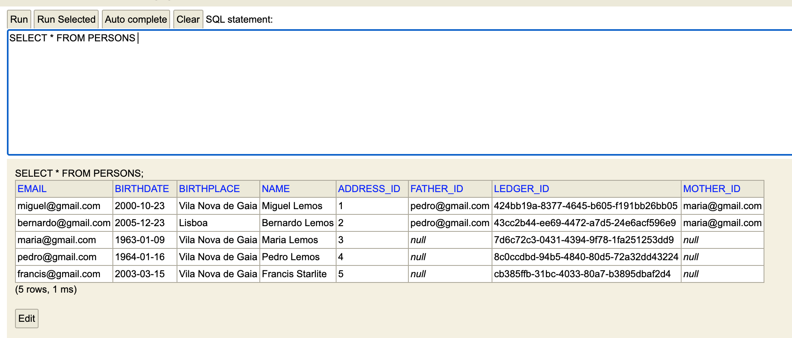

We can also observe, for example, the groups created in the database:

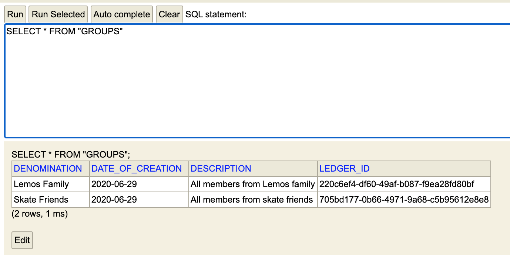

To be able to see the Web App itself, you should have React installed on your computer.
In case you already have, open the terminal in your project's folder and **run "npm install"**
in order to install all the node dependencies.

Afterwards, **run "npm start"** and your Browser will automatically open up a new page with
[http://localhost:3000](http://localhost:3000), where you will be able to see the Login page
for the application.

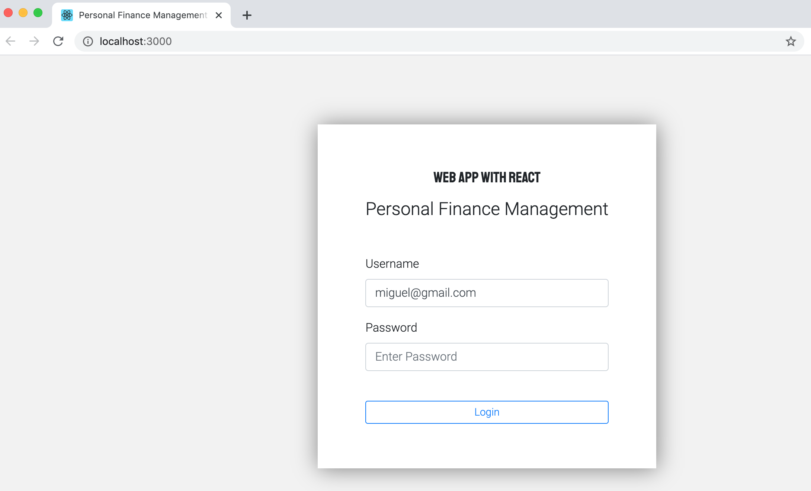

To login on the application, please **introduce the e-mail associated with any of the 5 Persons**
created in the Bootstrapping (to follow the example, you can try miguel@gmail.com). No password is
required, as I haven't implemented that functionality (I should probably do an entire tutorial
on the topic of authentication/authorization... very interesting topic nowadays).

After you successfully login, you'll find the following page: 

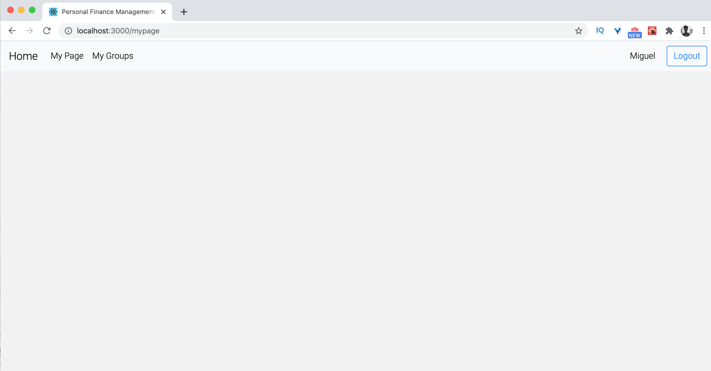

And.... *voilà*! You've entered the application as a registered member, and you can access all of the
functionalities (US) created in the backend!

For example, you can: 
* view your existing Accounts and Categories and create new ones;
* view your current Ledger and add new Transactions;
* check the Groups that you're apart of;
* view and create new Accounts and Categories for any Group in which you are an administrator;
* add members to your Group (only if you're a group administrator);
* add transactions to your Group Ledger;
* etc.

Let's take a look at our list of Categories:

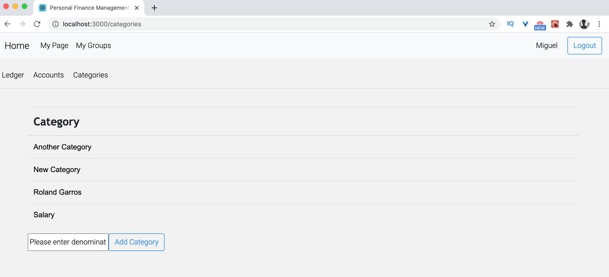

Having a project with **high levels of modularity** makes it extremely easy to make adjustments as each part
is as independent from the others as possible.

For example, if you want to change something regarding a specific service, you should only change that
functionality within the **applicationLayer folder** without having the need to change it anywhere
else.

This way, you are building Software that is **extremely flexible**, copes well with changes (see [Open-closed principle](https://en.wikipedia.org/wiki/Open%E2%80%93closed_principle) from SOLID), 
and ultimately it will drastically **reduce the maintenance costs over the years**.

Software Engineering is always about the same type of questions. The only difference between projects is that
business rules obviously change. If you have a good understanding of the patterns and principles applied
during the development stage, you are able to successfully work on several different projects because
you understand the **core of software development**. 
 

***

### Bibliography ###

I would like to credit all my teachers at [ISEP.IPP](https://www.isep.ipp.pt/Department/Department/14), a 
university located in sunny Porto (Portugal).

I would also like to credit the following books for additional insights:

* **Dive Into Design Patterns** by Alexander Shvets;
* **Applying UML and Patterns** by Craig Larman;
* **DDD - Domain-Driven Design** by Eric Evans.

To be completely honest, I didn't read Eric's book in its entirety, even though it is the ultimate
foundation of the concept of a DDD model. Instead, I've read **"Domain-Driven Design Quickly"**
by Abel Avram and Floyd Marinescu, which is an excellent summary of Eric's piece.


***

If you enjoyed this tutorial, feel free to say "hello" to me through my website at 
[miguelemos.github.io](miguelemos.github.io) - I am happy to discuss any question related to this tutorial
or anything else that's on your mind!

